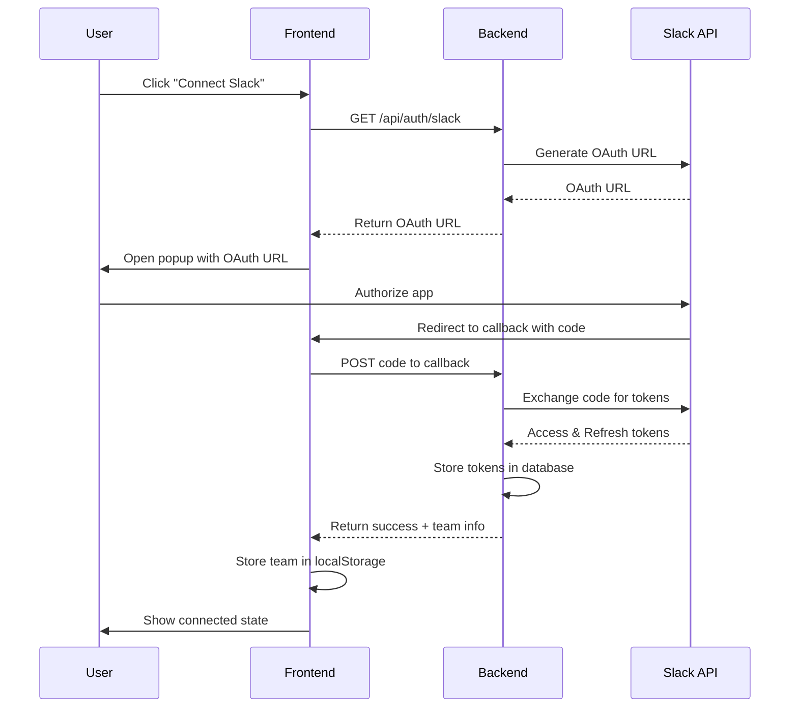
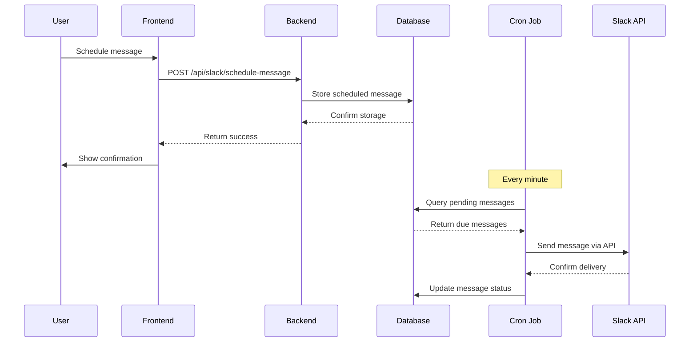

# Slack Connect - Frontend

A modern React application that enables users to connect their Slack workspace, send messages immediately, and schedule messages for future delivery.

## 🚀 Features

- **Secure OAuth 2.0 Integration**: Connect to Slack workspace with secure authentication
- **Real-time Message Sending**: Send messages to any Slack channel instantly
- **Message Scheduling**: Schedule messages for future delivery with date/time picker
- **Scheduled Message Management**: View, manage, and cancel scheduled messages
- **Modern UI**: Built with React, TypeScript, and Tailwind CSS
- **Responsive Design**: Works seamlessly on desktop and mobile devices

## 🛠️ Tech Stack

- **Frontend Framework**: React 19.1.1
- **Language**: TypeScript 5.8.3
- **Build Tool**: Vite 7.1.2
- **Styling**: Tailwind CSS 4.1.12
- **UI Components**: Radix UI primitives
- **HTTP Client**: Axios 1.11.0
- **Date Picker**: React DatePicker 8.7.0
- **Validation**: Zod 4.1.5

## 📋 Prerequisites

Before you begin, ensure you have the following installed:

- **Node.js** (version 18.0 or higher)
- **npm** or **yarn** package manager
- **Git** for version control

## 🔧 Installation

1. **Clone the repository**
   ```bash
   git clone <repository-url>
   cd slack-connect-app
   ```

2. **Install dependencies**
   ```bash
   npm install
   # or
   yarn install
   ```

3. **Environment Configuration**
   Create a `.env` file in the root directory:
   ```env
   VITE_REACT_APP_API_URL=http://localhost:5000/api
   ```

4. **Start the development server**
   ```bash
   npm run dev
   # or
   yarn dev
   ```

5. **Open your browser**
   Navigate to `http://localhost:5173` to view the application.

## 🏗️ Project Structure

```
slack-connect-app/
├── public/
│   ├── oauth-callback.html    # OAuth callback page
│   └── vite.svg
├── src/
│   ├── components/
│   │   ├── shared/            # Shared components
│   │   │   ├── connect-slack.tsx
│   │   │   ├── message-composer.tsx
│   │   │   ├── scheduled-message.tsx
│   │   │   └── index.ts       # Barrel exports
│   │   └── ui/                # Reusable UI components
│   │       ├── button.tsx
│   │       ├── card.tsx
│   │       ├── input.tsx
│   │       └── ...
│   ├── constants/             # Application constants
│   ├── lib/                   # Utility functions
│   │   ├── utils.ts
│   │   ├── storage.utils.ts
│   │   ├── date.utils.ts
│   │   ├── validation.utils.ts
│   │   └── index.ts
│   ├── services/
│   │   └── api.ts             # API service layer
│   ├── types/
│   │   └── index.ts           # TypeScript type definitions
│   ├── styles/
│   ├── App.tsx                # Main application component
│   ├── main.tsx               # Application entry point
│   └── index.css              # Global styles
├── package.json
├── tsconfig.json
├── vite.config.ts
└── README.md
```

## 🏗️ Architectural Overview

### System Architecture

The Slack Connect application follows a modern client-server architecture with clear separation of concerns:

```
┌─────────────────┐    ┌─────────────────┐    ┌─────────────────┐
│   React App     │    │  Express.js     │    │   Slack API     │
│   (Frontend)    │◄──►│   (Backend)     │◄──►│   (External)    │
│                 │    │                 │    │                 │
│ • OAuth UI      │    │ • OAuth Handler │    │ • Authentication│
│ • Message Form  │    │ • Token Mgmt    │    │ • Message API   │
│ • Scheduling UI │    │ • Cron Jobs     │    │ • Channel API   │
│ • State Mgmt    │    │ • SQLite DB     │    │                 │
└─────────────────┘    └─────────────────┘    └─────────────────┘
```

### Frontend Architecture

#### **Component Hierarchy**
```
App
├── ConnectSlack (OAuth Flow)
├── MessageComposer (Message Creation)
│   ├── ChannelSelector
│   ├── MessageInput
│   └── ScheduleOptions
└── ScheduledMessages (Message Management)
    ├── MessageList
    └── MessageActions
```

#### **State Management Pattern**
- **Local State**: Component-level state using `useState` and `useEffect`
- **Global State**: App-level state for team connection and UI state
- **Persistence**: LocalStorage for team data persistence
- **API State**: Managed through custom API service layer

#### **Data Flow Architecture**
1. **OAuth Flow**: Popup-based OAuth with postMessage communication
2. **API Communication**: Centralized API service with Axios
3. **State Updates**: Unidirectional data flow with proper state lifting
4. **Error Handling**: Comprehensive error boundaries and user feedback

### OAuth 2.0 Implementation

#### **Authentication Flow**


#### **Security Measures**
- **State Validation**: CSRF protection through state parameters
- **Secure Communication**: HTTPS-only in production
- **Token Security**: No sensitive tokens stored client-side
- **CORS Protection**: Properly configured cross-origin policies

### Message Scheduling Architecture

#### **Scheduling Flow**


#### **Cron Job Processing**
- **Frequency**: Every minute (`* * * * *`)
- **Atomic Operations**: Database transactions prevent race conditions
- **Error Handling**: Failed messages marked with error status
- **Retry Logic**: Built-in retry mechanism for transient failures

### Token Management System

#### **Token Lifecycle**
1. **Initial Acquisition**: OAuth flow provides access and refresh tokens
2. **Storage**: Tokens stored securely in SQLite database
3. **Validation**: Automatic token validation before API calls
4. **Refresh**: Automatic refresh when tokens expire
5. **Cleanup**: Invalid tokens removed from database

#### **Refresh Token Logic**
```typescript
async getValidToken(teamId: string): Promise<string> {
  const token = await this.getStoredToken(teamId);
  
  if (!token) {
    throw new Error('No token found');
  }
  
  // Check if token is expired
  if (token.expires_at && Date.now() >= token.expires_at) {
    if (token.refresh_token) {
      return await this.refreshToken(teamId, token.refresh_token);
    } else {
      throw new Error('Token expired and no refresh token available');
    }
  }
  
  return token.access_token;
}
```

### Database Design

#### **Schema Overview**
- **slack_tokens**: Stores OAuth tokens and team information
- **scheduled_messages**: Stores message scheduling data
- **Foreign Keys**: Proper relationships between tables
- **Indexing**: Optimized for frequent queries

#### **Data Relationships**
```
slack_tokens (1) ──┐
                   ├── (many) scheduled_messages
                   └── team_id (FK)
```

### Error Handling Strategy

#### **Frontend Error Handling**
- **API Errors**: Centralized error handling in API service
- **User Feedback**: Toast notifications and error states
- **Graceful Degradation**: Fallback UI for failed operations
- **Error Boundaries**: React error boundaries for component errors

#### **Backend Error Handling**
- **Validation Errors**: Zod schema validation
- **API Errors**: Proper HTTP status codes and error messages
- **Database Errors**: Transaction rollback and error logging
- **Slack API Errors**: Retry logic and error categorization

### Performance Optimizations

#### **Frontend Optimizations**
- **Code Splitting**: Lazy loading of components
- **Bundle Optimization**: Vite's built-in optimizations
- **Memory Management**: Proper cleanup of event listeners
- **Caching**: LocalStorage for team data persistence

#### **Backend Optimizations**
- **Database Indexing**: Optimized queries for performance
- **Connection Pooling**: Efficient database connections
- **Caching**: In-memory caching for frequently accessed data
- **Async Processing**: Non-blocking I/O operations

## 🔌 API Integration

The frontend communicates with the backend through a well-defined API service:

### Authentication
- `GET /api/auth/slack` - Get Slack OAuth URL
- OAuth callback handled via `public/oauth-callback.html`

### Slack Operations
- `GET /api/slack/channels/{teamId}` - Get available channels
- `POST /api/slack/send-message` - Send immediate message
- `POST /api/slack/schedule-message` - Schedule message
- `GET /api/slack/scheduled-messages/{teamId}` - Get scheduled messages
- `DELETE /api/slack/scheduled-messages/{messageId}` - Cancel scheduled message

## 🎨 UI Components

### Core Components

- **ConnectSlack**: OAuth connection interface
- **MessageComposer**: Message creation and scheduling form
- **ScheduledMessages**: List and management of scheduled messages

### Reusable UI Components

- **Button**: Customizable button component with variants
- **Card**: Container component for content sections
- **Input/Textarea**: Form input components
- **Select**: Dropdown selection component
- **Badge**: Status indicator component

## 🔧 Development

### Available Scripts

```bash
# Start development server
npm run dev

# Build for production
npm run build

# Preview production build
npm run preview

# Run linting
npm run lint
```

### Code Quality

- **ESLint**: Configured with React and TypeScript rules
- **Prettier**: Code formatting
- **TypeScript**: Strict type checking enabled

### Styling Guidelines

- Uses Tailwind CSS for styling
- Responsive design principles
- Consistent color scheme and typography

## 🚀 Deployment

### Build for Production

```bash
npm run build
```

This creates a `dist` folder with optimized production files.

### Environment Variables

For production deployment, set:

```env
VITE_REACT_APP_API_URL=https://your-backend-url.com/api
```

### Deployment Platforms

- **Vercel**: Recommended for React applications
- **Netlify**: Alternative deployment platform
- **GitHub Pages**: For static hosting

## 🔒 Security Considerations

- OAuth 2.0 flow for secure authentication
- No sensitive data stored in localStorage
- HTTPS required for production
- CORS properly configured with backend

## 🐛 Troubleshooting

### Common Issues

1. **OAuth Callback Issues**
   - Ensure backend is running on correct port
   - Check CORS configuration
   - Verify Slack app redirect URLs

2. **API Connection Issues**
   - Verify `VITE_REACT_APP_API_URL` environment variable
   - Check backend server status
   - Review browser console for errors

3. **Build Issues**
   - Clear `node_modules` and reinstall
   - Check TypeScript configuration
   - Verify all dependencies are installed

## 📝 Contributing

1. Fork the repository
2. Create a feature branch (`git checkout -b feature/amazing-feature`)
3. Commit your changes (`git commit -m 'Add some amazing feature'`)
4. Push to the branch (`git push origin feature/amazing-feature`)
5. Open a Pull Request

## 🤝 Support

For support, email jatin.srivastaval1909@gmail.com or create an issue in the repository.

---

**Note**: This frontend application requires the corresponding backend server to be running. Please refer to the backend repository for server setup instructions.